#results-array

In direct comparison of methylation for an individual oyster prior to and following heat shock approximately 10k differentially methylated features were identified as defined by >/= 1.8 fold difference.  For all oysters a majority of the features (individual probe regions) were hypomethylated. Specifically, for oysters #2, #4, and #6 the number of hypomethylated features was 7224, 6560, and 7645, respectively.  Genome feature tracks (bedGraph) for each oysters are available:  _genome-feature-tracks/2014.07.02.2M_sig.bedGraph, genome-feature-tracks/2014.07.02.4M_sig.bedGraph, genome-feature-tracks/2014.07.02.6M_sig.bedGraph_.   

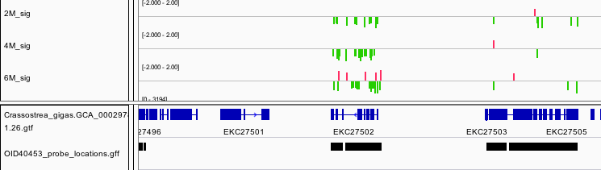


**Figure** - Screenshot of genome feature tracks showing differential methylation at individual probe level.


When only features were considered where at least 3 adjacent probes were also differentially methylated in the same direction the number of features (adjacent probe region merged when within 100bp) for oysters #2, #4, and #6 was 112, 58, and 62, respectively.  A majority of these features were hypomethylated (108, 48, and 53, respectively). Genome feature tracks (bedGraph) for each oysters are available in _genome-feature-tracks_ directory: 
```  
2M_3plusmerge_Hyper.bed
2M_3plusmerge_Hypo.bed
4M_3plusmerge_Hyper.bed
4M_3plusmerge_Hypo.bed
6M_3plusmerge_Hyper.bed
6M_3plusmerge_Hypo.bed
```

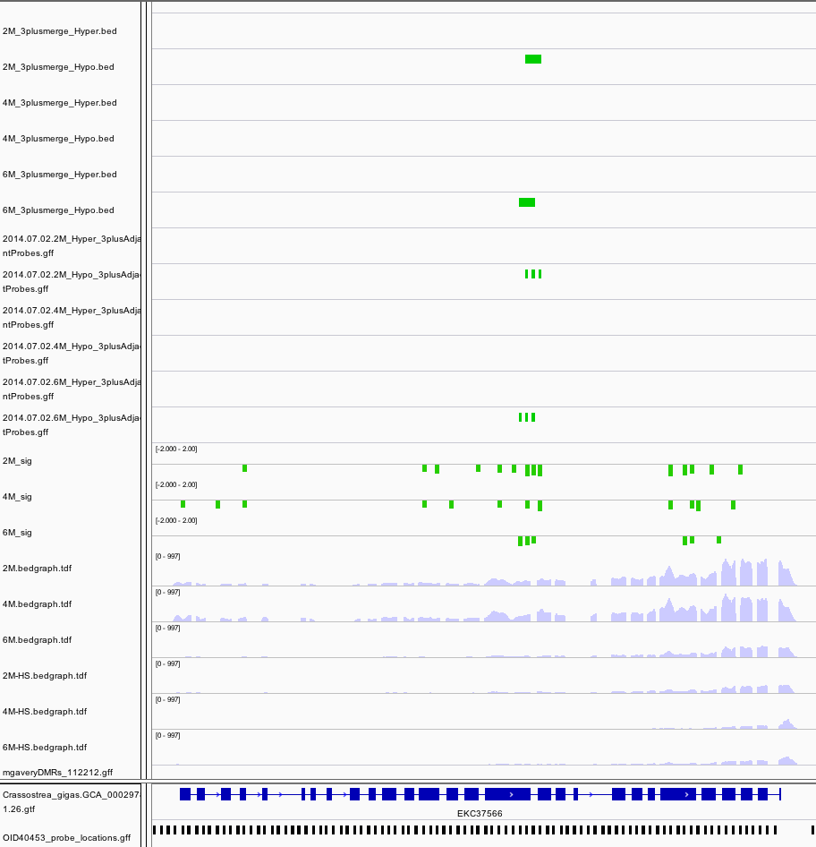


**Figure 2** Screenshot from IGV showing deaeration of merge tracks

**Table** - Number of features

Oyster | Hypo-probes | Hyper-probes | Hypo-3plus-merged | Hyper-3plus-merged
--- | --- | --- | --- | ---
2 | 7224 | 2803 | 108 | 4
4 | 6560 | 3587 | 48 | 10
6 | 7645 | 4044 | 53 | 9


In order to examine regions that were differentially methylated multiple oysters, feature were identified where there was at least three adjacent features that were present in at least two individuals. The specific locations are

```
scaffold481 576986  578532  -3
scaffold247 141885  142442  -3
scaffold247 144031  144583  -2
scaffold1518    212680  213736  -3
scaffold853 46186   46496   -2
scaffold406 419330  419384  -2
scaffold406 419005  419060  -2
scaffold406 418360  418767  -2
scaffold394 555813  556224  -2
scaffold242 75918   76344   -2
scaffold142 656144  656735  -2
scaffold12  243960  244376  -2
scaffold257 1235165 1235481 +2
```

With twelve features hypomethylated and one feature hypermethylated.

## Summary Table

Scaffold		|     Gene     |   I/E/Pro  |  Tandem Repeat | DEG | Generic Gene Methylation | Note
------------------|--------------|--------------|------------| 
scaffold481 | Bromodomain-containing protein 8 | I | Yes |  Yes | High | |
scaffold247 | Homeobox protein LOX2 | I | No | No | Medium | |
scaffold1518 | Tenascin | I | No | No | Low | |
scaffold853 |  E3 ubiquitin-protein ligase UHRF1 | Pro | Yes | No | Low | |
scaffold406 | Methylcrotonoyl-CoA carboxylase subunit alpha, mitochondrial | I  | Yes | No | Low | |
scaffold394 | Myosin heavy chain, striated muscle | I/E | No | Yes | Low | |
scaffold242 | Methylated-DNA–protein-cysteine methyltransferase | I | No | No | Low | LTR_Pao
scaffold142 | Nacrein-like protein / Carbonic anhydrase 2 | I | Yes | No | Low | |
scaffold12 | Collagen alpha–1(IV) chain | I | Yes | No | Medium | |
scaffold257 |  Insertion element IS1 protein insA* | ? | No | No | Low | |


Going down the list, _scaffold418_576986_ is a feature that overlaps gene EKC36328, [_Bromodomain-containing protein 8_](http://www.uniprot.org/uniprot/K1QRE8). Specifically the location is in the intron between exon 18 and 19 (total of 20 exons). This gene is differentially expressed, that is expressed at an elevated level following heat shock.

"The precise function of the domain is unclear, but it may be involved in protein-protein interactions and may play a role in assembly or activity of multi-component complexes involved in transcriptional activation [PMID: 7580139]."


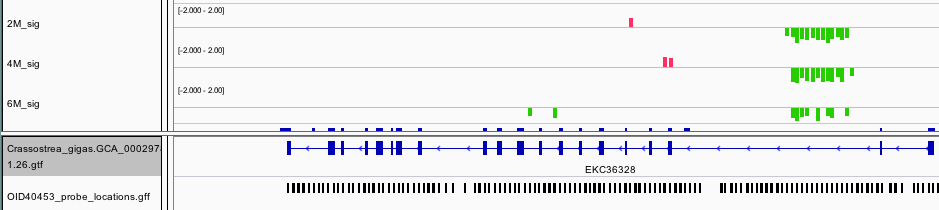

---
Another DMR that is consistent across oysters is located within the intron of [_Homeobox protein LOX2_](http://www.uniprot.org/uniprot/K1RXD0). Homeobox are transcription factors often associated with developmental processes.


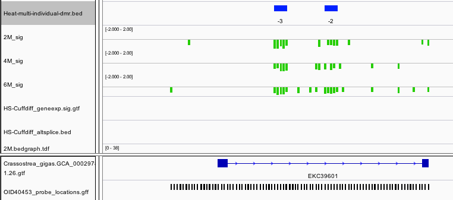

---

Significant hypomethylation is also present within the intron of [_Tenascin_](http://www.uniprot.org/uniprot/K1PZ30), a glycoprotein expressed in the extracellular matrix during stress.

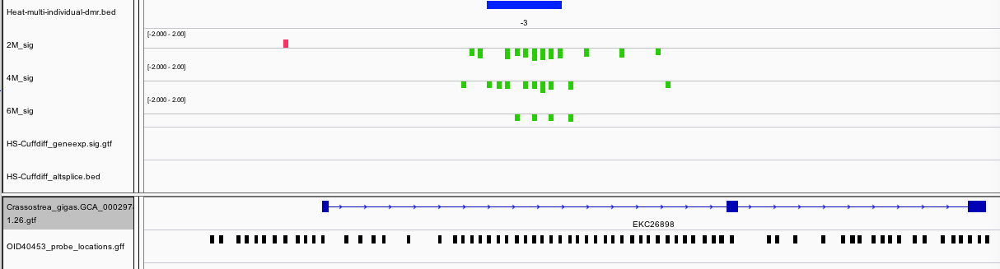  

---

We also found a DMR upstream of [_E3 ubiquitin-protein ligase UHRF1_](http://www.ncbi.nlm.nih.gov/protein?cmd=Retrieve&dopt=GenPept&list_uids=405967132).  Interestingly this is a protein that **bridges DNA methylation and chromatin modification**. 

"Specifically recognizes and binds hemimethylated DNA at replication forks via its YDG domain and recruits DNMT1 methyltransferase to ensure faithful propagation of the DNA methylation patterns through DNA replication. In addition to its role in maintenance of DNA methylation, also plays a key role in chromatin modification: through its tudor-like regions and PHD-type zinc fingers, specifically recognizes and binds histone H3 trimethylated at 'Lys-9' (H3K9me3) and unmethylated at 'Arg-2' (H3R2me0), respectively, and recruits chromatin proteins. Enriched in pericentric heterochromatin where it recruits different chromatin modifiers required for this chromatin replication. Also localizes to euchromatic regions where it negatively regulates transcription possibly by impacting DNA methylation and histone modifications. Has E3 ubiquitin-protein ligase activity by mediating the ubiquitination of target proteins such as histone H3 and PML. It is still unclear how E3 ubiquitin-protein ligase activity is related to its role in chromatin in vivo." ~http://www.uniprot.org/uniprot/Q96T88

While not classified as a differentially expressed gene, there does appear to be a trend towards increased expression upon heat stress. This occurrence would follow the traditional model where decreased methylation in the promoter region is associated with increased expression.

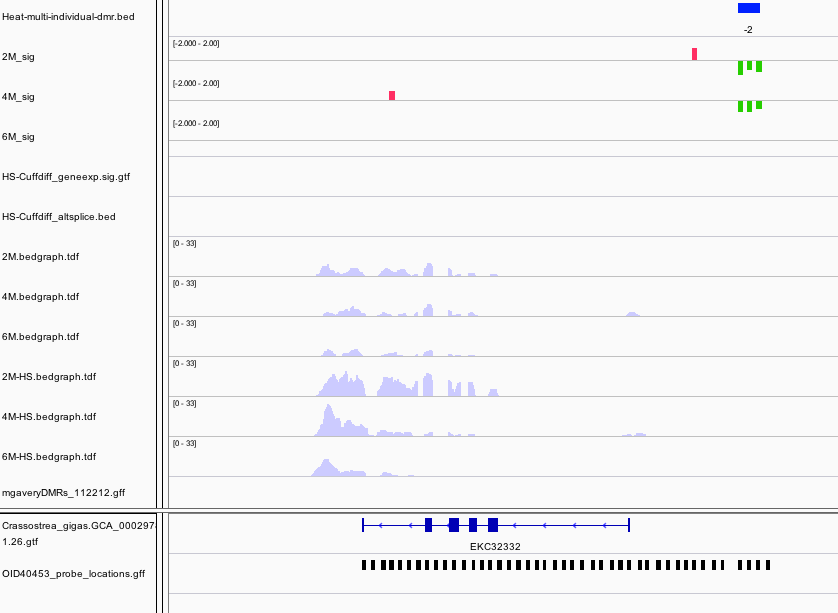  

---

There were three features identified that are in fact within an intron of [_Methylcrotonoyl-CoA carboxylase subunit alpha, mitochondrial_](http://www.uniprot.org/uniprot/K1RSA6), and enzyme involved in leucine and isovaleric acid catabolism.

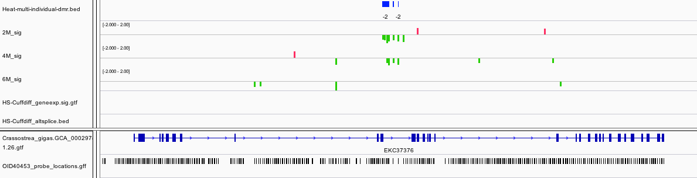  

---

In an another example of a DMR associated with a differentially expressed gene, a DMR that span an intron and exon within [_Myosin heavy chain, striated muscle_](http://www.uniprot.org/uniprot/K1RSS3).  In this case the gene is expressed at a lower level upon heat stress.  It is also worth pointing out this gene has very limited methylation overall based on other studies we have done. 

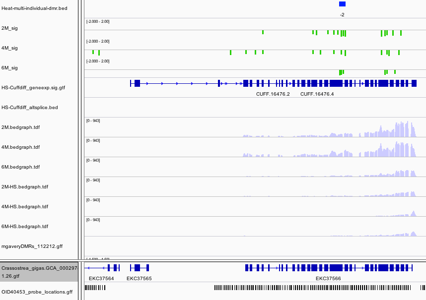

---

Another interesting DMR was found in [_Methylated-DNA--protein-cysteine methyltransferase_](http://www.uniprot.org/uniprot/K1RE67). 

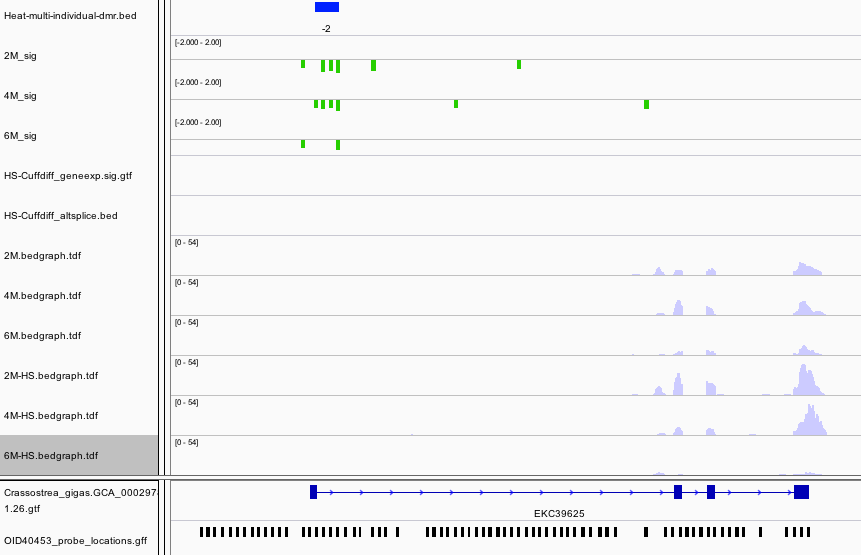

---

Within the intron of a [_Nacrein-like protein_](http://www.uniprot.org/uniprot/A0ZSF7) is a hypomethylated DMR.  This is a negative regulator of calcification in shells of mollusks. 

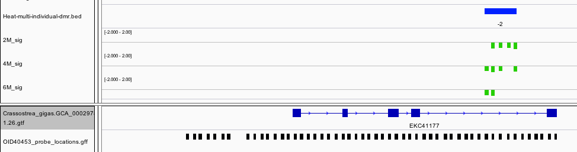


---

[_Collagen alpha-1(IV) chain_](http://www.uniprot.org/uniprot/P02462) is another gene that contains a hypomethylated DMR. This protein is the major structural component of basement membranes.

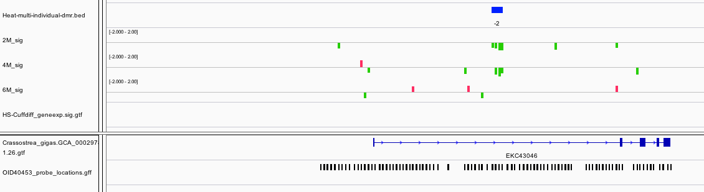

---

The only DMR that is hypermethylated is odd in the fact that annotation was dropped one the data was integrated into Ensembl. This could be related to the fact that the closest blast hit to this gene model is [_Insertion element IS1 protein insA_](http://www.uniprot.org/uniprot/P19767) and transposable element in prokaryotes.


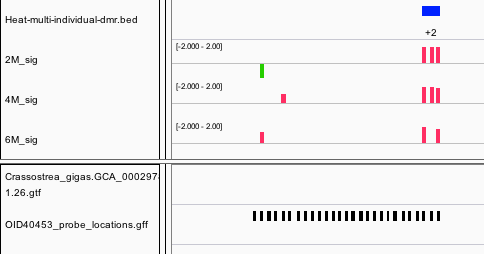

---

## Summary Table

